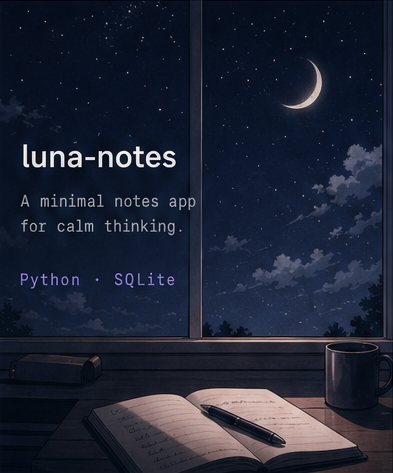
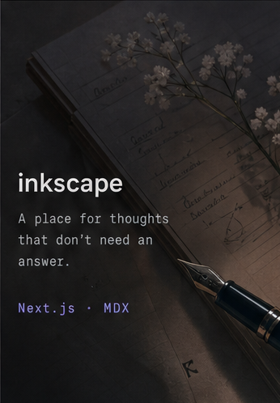
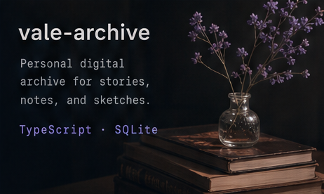
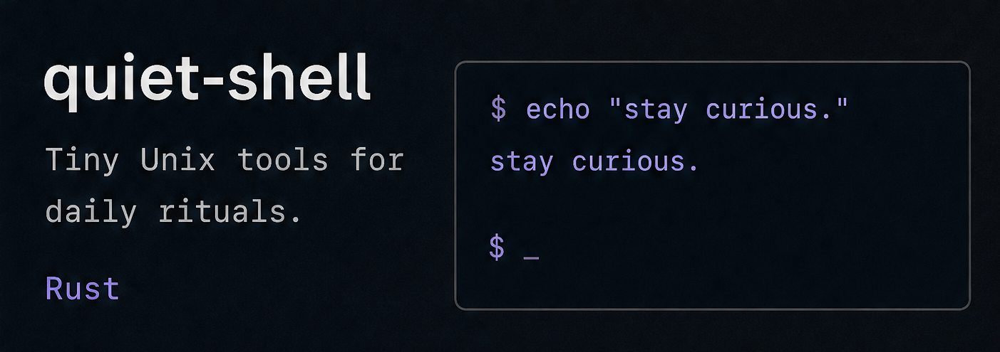

<table border="0" cellspacing="0" cellpadding="0" style="border: none; border-collapse: collapse;">
  <tr style="border: none;">
    <td width="55%" align="left" valign="middle" style="border: none;">
      <h1>☾ ReverieVale</h1>
      
<code>building quietly.</code>

       
      
<b>✦ ABOUT</b>

      
A quiet builder who loves elegant code, beautiful ideas, and meaningful details.

       
      
<code>curious</code> · <code>creative</code> · <code>calm</code>

    </td>
    <td width="45%" align="center" valign="middle" style="border: none;">
      
    </td>
  </tr>
</table>

  

<b>✦ PROJECTS</b>

<table border="0" cellspacing="0" cellpadding="0" style="border: none; border-collapse: collapse; width: 100%;">
  <tr style="border: none;">
    <td width="33%" align="center" valign="top" style="border: none; padding-right: 6px;">
      
    </td>
    <td width="33%" align="center" valign="top" style="border: none; padding-right: 6px;">
      
    </td>
    <td width="34%" align="center" valign="top" style="border: none;">
      
        
      
    </td>
  </tr>
</table>

  

<table border="0" cellspacing="0" cellpadding="0" style="border: none; border-collapse: collapse; width: 100%;">
  <tr style="border: none;">
    <td width="50%" align="left" valign="middle" style="border: none;">
      
<b>✦ CURRENTLY LEARNING</b>

      <h2>Python · Web · Linux</h2>
      
always learning, always building.

    </td>
    <td width="50%" align="center" valign="middle" style="border: none;">
      <h1 style="font-size: 28px;">君の名は。</h1>
      
y o u r &nbsp; n a m e .

    </td>
  </tr>
</table>

  

// thank you for visiting

☾

